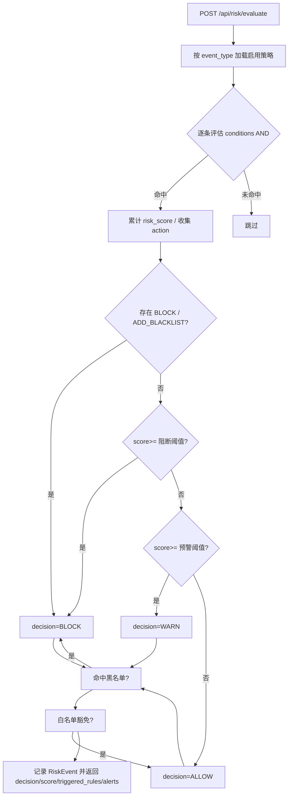

# 企业风控中台（Risk Control Platform）

基于本目录中《知识库管理平台》文档的架构（FastAPI 后端 + 前端 + RBAC + 审计 + 看板），
扩展实现的一套**可运行的风险控制系统**。核心是一个**规则/策略引擎 + 风险评分 + 决策 API + 黑白名单 + 事件/告警 + 看板 + 审计**的完整闭环。

> 适用版本：v1.0.0  
> 技术栈：Python 3.13 / FastAPI / SQLAlchemy / SQLite / 原生 JS 前端（零构建、可离线）

---

## 1. 与知识平台文档的对应关系

| 知识平台模块（文档） | 风控中台对应实现 |
| --- | --- |
| `02_代码框架说明` 分层（api / services / models / schemas / middlewares） | 完全一致的分层结构 |
| `03_核心流程图` RBAC 中间件 + 权限码 | `middlewares/rbac.py` + `api/deps.py` 的 `require_perm` 依赖 |
| `04_核心模块` 安全边界（无权限不暴露） | 决策接口只返回决策/评分/告警，不泄露命中知识内容 |
| 操作日志 / AI 访问日志 | `OperationLog` 审计表 + `/api/audit/logs` |
| 数据看板 | `/api/dashboard/overview` 聚合统计与趋势 |

---

## 2. 目录结构

```
risk_control_system/
├── backend/
│   ├── app/
│   │   ├── main.py                 # FastAPI 入口，挂载前端静态资源
│   │   ├── core/                   # config、security(JWT/密码)
│   │   ├── db/                     # engine、session、Base
│   │   ├── models/                 # auth(用户/角色/权限) + risk(策略/事件/黑白名单/审计)
│   │   ├── schemas/                # Pydantic 请求/响应
│   │   ├── services/               # 业务逻辑：风控引擎、策略、事件、黑白名单、看板、审计
│   │   ├── api/                    # 路由层：auth/policy/risk/blacklist/dashboard/audit
│   │   ├── middlewares/            # RequestID 中间件
│   │   └── utils/
│   ├── scripts/seed.py             # 权限/角色/用户/示例策略种子
│   ├── requirements.txt
│   └── .env.example
├── frontend/
│   └── index.html                  # 原生 JS 控制台（登录/看板/策略/事件/黑白名单/审计）
└── README.md
```

---

## 3. 快速启动

```bash
cd backend
python -m venv .venv
.\.venv\Scripts\Activate.ps1        # Windows PowerShell；Linux/macOS 用 source .venv/bin/activate
pip install -r requirements.txt
cp .env.example .env                # 生产环境务必修改 JWT_SECRET_KEY 与关闭弱密码
python scripts/seed.py              # 初始化权限、角色、用户、示例策略
uvicorn app.main:app --host 0.0.0.0 --port 8000
```

前端访问：<http://localhost:8000>（FastAPI 直接托管 `frontend/index.html`）。

### 演示账号（密码均为 `123456`）

| 角色 | 用户名 | 权限范围 |
| --- | --- | --- |
| 超级管理员 | `admin` | 全部 |
| 风控管理员 | `risk_admin` | 策略/事件/黑白名单/看板 |
| 审计员 | `auditor` | 事件/看板/审计 |
| 普通用户 | `normal_user` | 仅看板 |

> 默认账号仅用于本地演示，生产环境必须更换密码与 JWT 密钥。

---

## 4. 风控核心概念

### 4.1 策略（RiskPolicy）
- `event_type`：适用事件（`ALL` / `LOGIN` / `KNOWLEDGE_ACCESS` / `EXPORT` / `IMPORT`）。
- `conditions`：条件列表，**AND** 关系。每个条件 `{field, op, value}`，支持
  `eq / ne / gt / gte / lt / lte / in / not_in / contains / regex / exists`，字段支持点号路径（如 `user.ip`）。
- `action`：`ALLOW` / `WARN` / `BLOCK` / `ADD_BLACKLIST`。
- 命中后累计 `risk_score`，并依据阈值（`RISK_WARN_THRESHOLD=60`、`RISK_BLOCK_THRESHOLD=100`）升级决策。

### 4.2 决策流程（Mermaid）



### 4.3 黑白名单
- `BLACK` 命中即阻断；`WHITE` 命中豁免阻断。
- 支持 `IP` / `USER` / `DEPARTMENT`，可设过期时间。
- `ADD_BLACKLIST` 动作的策略命中后会自动写入黑名单（来源 `POLICY`）。

### 4.4 风险事件与看板
- 每次决策都会落库到 `RiskEvent`，可在「风险事件」页追溯 payload / 触发策略 / 请求 ID。
- 看板聚合：事件总数、阻断/预警/放行分布、近 7 天趋势、高频触发策略、高频被阻断主体、策略与黑名单规模。

---

## 5. 主要接口

| 方法 | 路径 | 权限 | 说明 |
| --- | --- | --- | --- |
| POST | `/api/auth/login` | 公开 | 登录获取 JWT |
| GET | `/api/auth/me` | 登录 | 当前用户与权限码 |
| GET | `/api/policies` | `risk:policy:view` | 策略列表 |
| POST/PUT/DELETE | `/api/policies[/:id]` | `risk:policy:manage` | 策略管理 |
| POST | `/api/risk/evaluate` | `risk:event:evaluate` | 风控决策（核心） |
| GET | `/api/risk/events` | `risk:event:view` | 风险事件 |
| GET/POST/DELETE | `/api/blacklist[/:id]` | `risk:blacklist:*` | 黑白名单 |
| GET | `/api/dashboard/overview` | `dashboard:view` | 看板聚合 |
| GET | `/api/audit/logs` | `audit:view` | 审计日志 |

---

## 6. 决策接口示例

```bash
curl -X POST http://localhost:8000/api/risk/evaluate \
  -H "Authorization: Bearer <token>" -H "Content-Type: application/json" \
  -d '{"event_type":"EXPORT","payload":{"export_count":200},"actor":"bob","ip":"1.2.3.4"}'
# => {"decision":"BLOCK","score":100,"triggered_rules":[...],"alerts":[...],"blacklisted":false}
```

---

## 7. 二次开发建议

- 新增事件类型：在 `risk_engine_service.evaluate` 中已按 `event_type` 匹配策略，直接在前端/调用方传入新类型即可，无需改引擎。
- 新增条件操作符：在 `risk_engine_service.OPS` 中补充。
- 接入真实数据源：把业务系统的登录、访问、导出行为通过 `/api/risk/evaluate` 上报即可统一风控。
- 生产加固：替换 SQLite 为 PostgreSQL/MySQL，设置强 `JWT_SECRET_KEY`，关闭弱密码，关闭 Mock（本系统无 Mock 依赖）。
